# Instabug
## **Dockerfile that build the app and try to make it as lightweight as you can.**
Use the Dockerfile inside the internship folder to build the image to build the app:
```bash
    docker build -t api-app .
```
then check the size of the image:

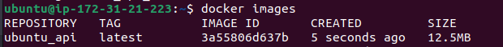

and run the docker image but must sure that there is MYSQL server running in your machine:
```bash
    docker run -p 9090:9090 --network <your-network> api-app
```

** if MYSQL server run in local machine: Use **host** network

** if MYSQL server run in docker container: you must ensure that the app run in the **same network of mysql container**

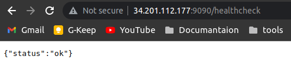


## **Pipeline job to build the app using the docker file**
Build a jenkins image that can build docker same as the jenkins-Dockerfile in the internship folder:
```bash
FROM jenkins/jenkins:lts
USER root
# Install Docker
RUN apt-get update && \
    apt-get install -y apt-transport-https ca-certificates curl gnupg2 software-properties-common && \
    curl -fsSL https://download.docker.com/linux/debian/gpg | apt-key add - && \
    add-apt-repository "deb [arch=amd64] https://download.docker.com/linux/debian $(lsb_release -cs) stable" && \
    apt-get update && \
    apt-get install -y docker-ce-cli
```
Then build and run this image:
```bash
    docker build -t jenkins -f jenkins-Dockerfile
    docker run -d -p 8080:8080 -v /var/run/docker.sock:/var/run/docker.sock --name jenkins jenkins
```
get the logs for this running image to get the default password of jenkins server:
```bash
    docker logs jenkins
```
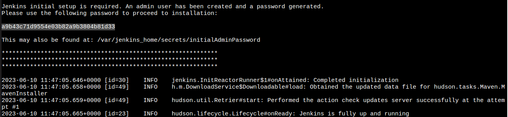
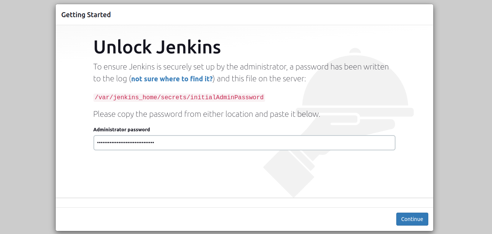

Then add the credentials for GitHub and DockerHub:
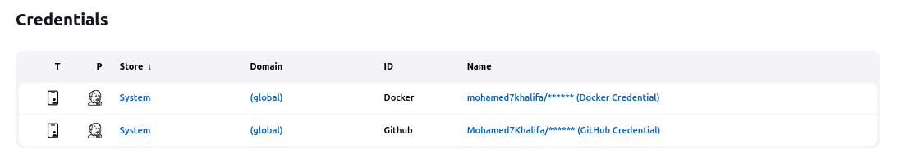

Create the pipeline and set the configuration:
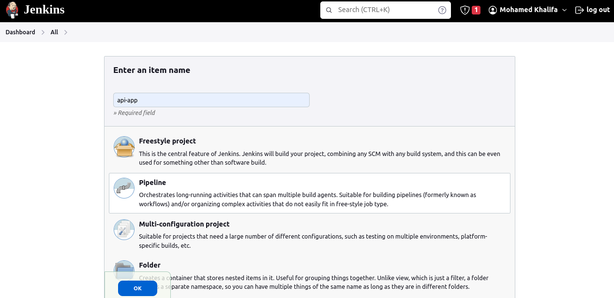
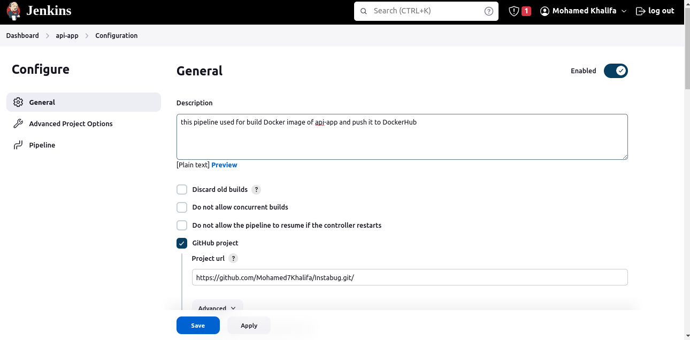
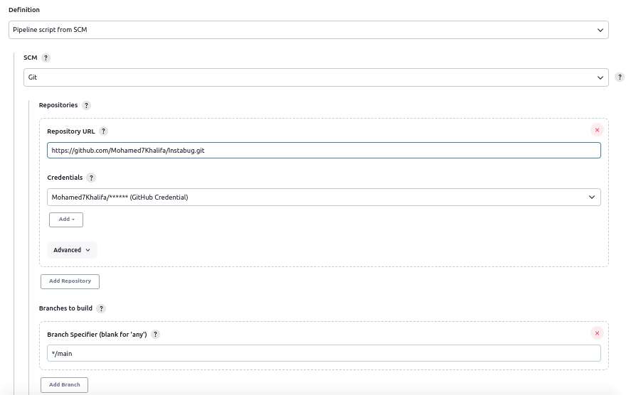

At the end you can build the pipeline:
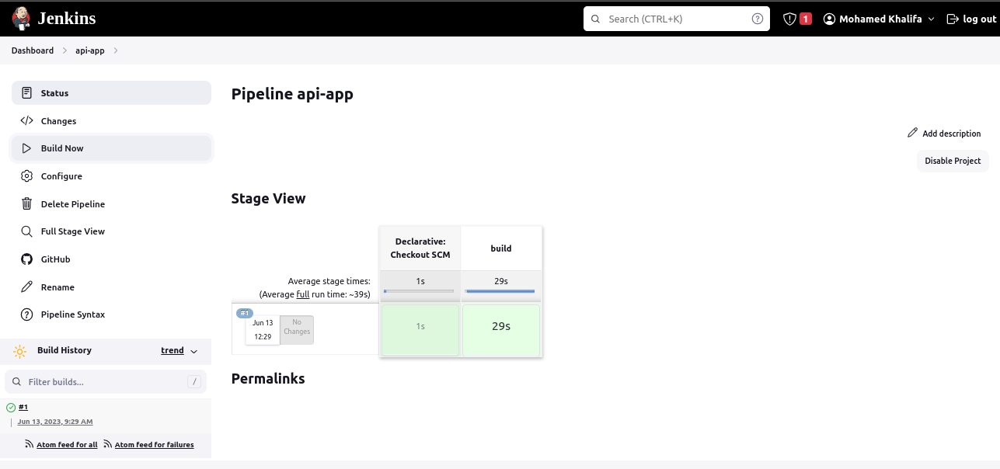
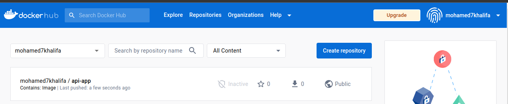

Integrate Slack to Jenkins to report the status of the build and send reports of failure

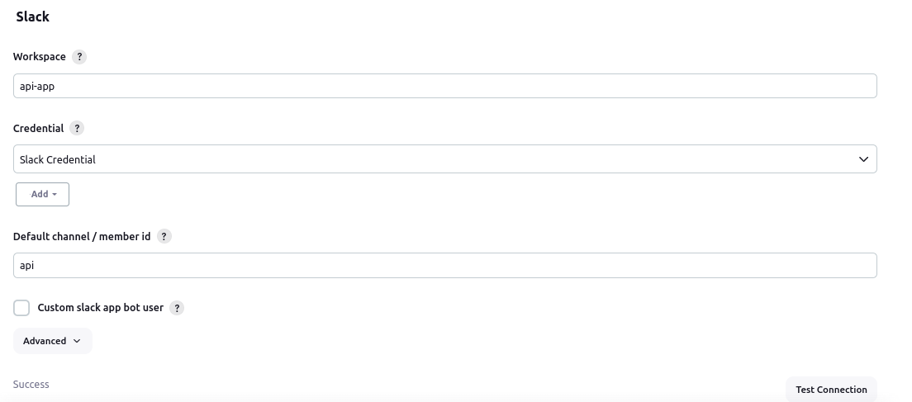
At Success
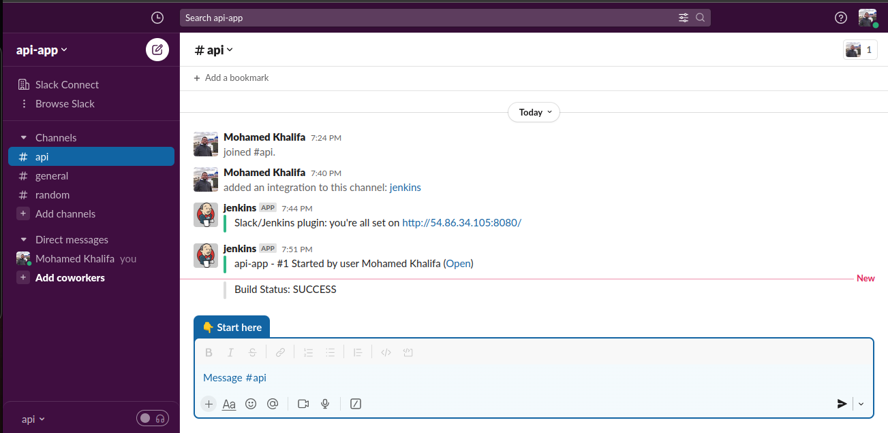
At Failure
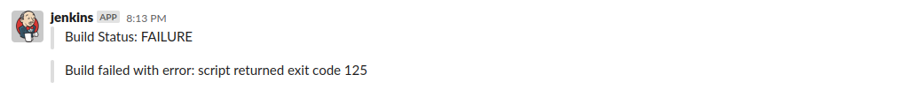


## **Docker compose file that contains both application and mysql database so you can run the app locally**

the docker-compose file in the internship folder

## **Helm manifests for kubernetes to deploy the app using them on kubernetes with adding config to support high availability and volume persistence and exposing service to the public**

To start helm manifests open terminal in k8s folder and run:
```bash 
    helm instal api-app ./api-app
```
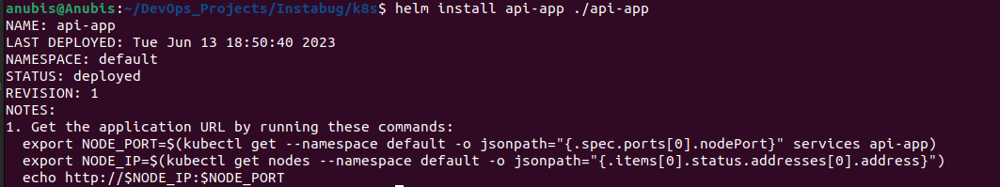

Check the ip of minikube to open in browser:
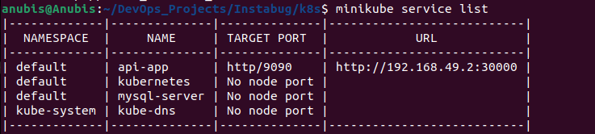

Check Kubernetes services and endpoint for the NodePort and see the status of the pods:
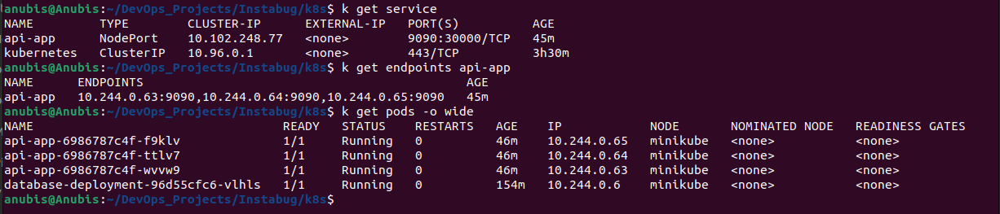

Check the app running in browser:

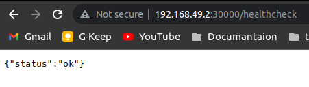

